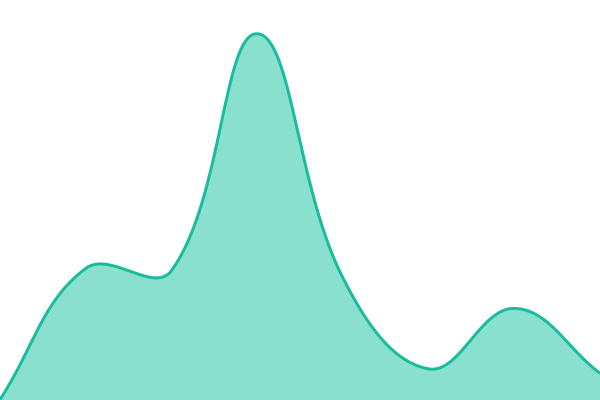
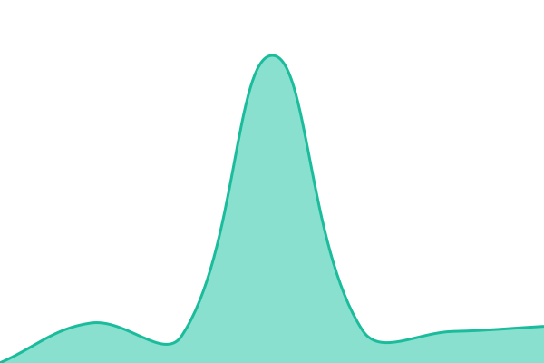

# [📈 Live Status](https://upptime.github.io/upptime): <!--live status--> **🟧 Partial outage**

This repository contains the open-source uptime monitor and status page for [Upptime](https://upptime.js.org), powered by [Upptime](https://github.com/upptime/upptime).

With [Upptime](https://upptime.js.org), you can get your own unlimited and free uptime monitor and status page, powered entirely by a GitHub repository. We use [Issues](https://github.com/upptime/upptime/issues) as incident reports, [Actions](https://github.com/davorg/uptime/actions) as uptime monitors, and [Pages](https://upptime.github.io/upptime) for the status page.

<!--start: status pages-->
<!-- This summary is generated by Upptime (https://github.com/upptime/upptime) -->
<!-- Do not edit this manually, your changes will be overwritten -->
<!-- prettier-ignore -->
| URL | Status | History | Response Time | Uptime |
| --- | ------ | ------- | ------------- | ------ |
|  [Line of Succession](https://lineofsuccession.co.uk/) | 🟩 Up | [line-of-succession.yml](https://github.com/davorg/uptime/commits/HEAD/history/line-of-succession.yml) | 

 1059ms
     
 | 

<a href="https://davorg.github.io/uptime/history/line-of-succession">100.00%</a>
    

|  [Dave Cross](https://davecross.co.uk/) | 🟩 Up | [dave-cross.yml](https://github.com/davorg/uptime/commits/HEAD/history/dave-cross.yml) | 

 195ms
     
 | 

<a href="https://davorg.github.io/uptime/history/dave-cross">100.00%</a>
    

|  [dave.org.uk](https://dave.org.uk/) | 🟩 Up | [dave-org-uk.yml](https://github.com/davorg/uptime/commits/HEAD/history/dave-org-uk.yml) | 

 227ms
     
 | 

<a href="https://davorg.github.io/uptime/history/dave-org-uk">100.00%</a>
    

|  [Davblog](https://blog.dave.org.uk/) | 🟩 Up | [davblog.yml](https://github.com/davorg/uptime/commits/HEAD/history/davblog.yml) | 

 3444ms
     
 | 

<a href="https://davorg.github.io/uptime/history/davblog">99.85%</a>
    

|  [Perl Hacks](https://perlhacks.com/) | 🟩 Up | [perl-hacks.yml](https://github.com/davorg/uptime/commits/HEAD/history/perl-hacks.yml) | 

 1343ms
     
 | 

<a href="https://davorg.github.io/uptime/history/perl-hacks">100.00%</a>
    

|  [Feeds](https://feeds.davecross.co.uk/) | 🟩 Up | [feeds.yml](https://github.com/davorg/uptime/commits/HEAD/history/feeds.yml) | 

 390ms
     
 | 

<a href="https://davorg.github.io/uptime/history/feeds">100.00%</a>
    

|  [Lystyng](https://lystyng.com/) | 🟩 Up | [lystyng.yml](https://github.com/davorg/uptime/commits/HEAD/history/lystyng.yml) | 

 188ms
     
 | 

<a href="https://davorg.github.io/uptime/history/lystyng">100.00%</a>
    

|  [Melody](https://melody.red-mirror.com/) | 🟥 Down | [melody.yml](https://github.com/davorg/uptime/commits/HEAD/history/melody.yml) | 

 806ms
     
 | 

<a href="https://davorg.github.io/uptime/history/melody">100.00%</a>
    

|  [Perl Diver Auth](https://pdauth.perlhacks.com/) | 🟥 Down | [perl-diver-auth.yml](https://github.com/davorg/uptime/commits/HEAD/history/perl-diver-auth.yml) | 

 486ms
     
 | 

<a href="https://davorg.github.io/uptime/history/perl-diver-auth">0.00%</a>
    

|  [AdServer](https://ads.davecross.co.uk/) | 🟩 Up | [ad-server.yml](https://github.com/davorg/uptime/commits/HEAD/history/ad-server.yml) | 

 1093ms
     
 | 

<a href="https://davorg.github.io/uptime/history/ad-server">100.00%</a>
    

|  [Klortho](https://klortho.perlhacks.com/) | 🟩 Up | [klortho.yml](https://github.com/davorg/uptime/commits/HEAD/history/klortho.yml) | 

 268ms
     
 | 

<a href="https://davorg.github.io/uptime/history/klortho">100.00%</a>
    

|  [Aphra](https://aphra.perlhacks.com/) | 🟩 Up | [aphra.yml](https://github.com/davorg/uptime/commits/HEAD/history/aphra.yml) | 

 202ms
     
 | 

<a href="https://davorg.github.io/uptime/history/aphra">100.00%</a>
    

<!--end: status pages-->

[**Visit our status website →**](https://upptime.github.io/upptime)

## 📄 License

- Powered by: [Upptime](https://github.com/upptime/upptime)
- Code: [MIT](./LICENSE) © [Upptime](https://upptime.js.org)
- Data in the `./history` directory: [Open Database License](https://opendatacommons.org/licenses/odbl/1-0/)
